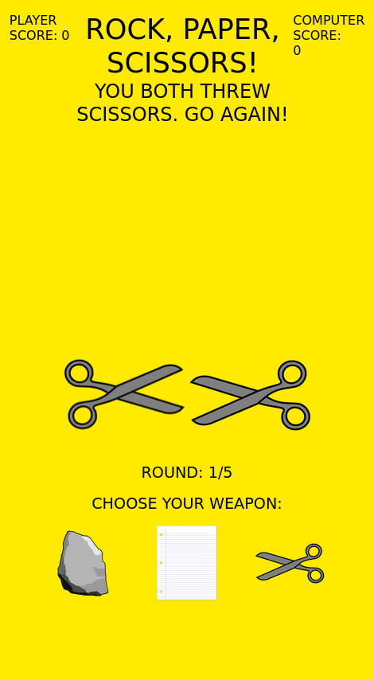

# Readme
# Rock, Paper, Scissors!

## Overview

The grade-school classic... with a GUI :O   !

### Challenge

The project requirements can be found [here](https://www.theodinproject.com/paths/foundations/courses/foundations/lessons/revisiting-rock-paper-scissors) in The Odin Project's curriculum.  Although this GUI isn't a work of art, I did go a little
bit above and beyond the requirements to add some CSS animations.  

### Screenshot

  

### Links

- [Live site](https://mattdimicelli.github.io/RockPaperScissors/)
- [Repo](https://github.com/mattdimicelli/RockPaperScissors)

## My process
- An earlier iteration of this project was text-only.  The app that you see here
is a refactor to add a GUI.
  
### Built with
- Vanilla JS, CSS, and HTML.
- Media queries and Flexbox for responsive-design
- CSS Animations
- The New CSS Reset, which removes all default browser styles except for the "display" property

### What I learned

I believe that the original version of this was my first JS program built from 
scatch... so needless to say it was a learning experience!

This is probably the only time that I have played around with CSS animations.
That entailed learning how to coordinate different animation events using 
calls to setTimeout().  One moment that I remember is realizing that even if
I put x milliseconds as the delay for the timer, I might end up getting a 
longer delay, due to the way async processes are executed in the broswer.  I 
read about JS being single-threaded, the call stack, the event loop, web APIs
built into the *browser* (eg. not built-into JS itself, such as the very 
setTimeout()), the task queue, blocking vs. non-blocking, and asynchronous 
callbacks.  